# Transformer-CNN-2D-3D-classification
## Framework Features
This deep learning framework offers 1,000+ models (including 100+ specialized CNN-Transformer hybrids for 2D/3D multimodal images) with a modular design for fully customizable components: adaptive training optimization, data preprocessing, model restructuring, and visual analytics (heatmap/gradient map generation)

## 框架特点
本深度学习框架集成了1000+模型（包含100+原创的CNN-Transformer混合架构，适用于2D/3D多模态图像处理）。 该框架采用模块化设计，各功能组件可独立配置：训练策略优化、数据预处理、模块结构重组以及可视化分析（支持热力图与梯度图生成）， 从而显著提升模型开发全流程（训练/验证/测试）的效率。

---

---
# Contact Information (YXY联系方式)
## Code Developer (代码开发者): xinyu.ye (叶鑫宇)
<span style="font-size:20px">Email (邮箱):  3303626778@qq.com, yexinyubmd@163.com  </span>  
<span style="font-size:20px">WeChat/Phone (微信/手机号):   +86 186-0940-7358  </span>   
Note: The complete code package is 60GB in size (including ~55GB dataset), which exceeds GitHub's 1GB repository limit. We have therefore created a reduced version for GitHub. Please note this current Git version has not yet been fully debugged.  
The dataset will be made publicly available according to our laboratory's data release policy. For updates, please follow our lab's forthcoming publications. Thank you for your interest in our work.  

说明：完整代码包大小为60GB（包含约55GB数据集），超出GitHub的1GB仓库限制。因此我们提供了适用于GitHub的精简版本。请注意当前Git版本尚未完成完整调试。  
数据集将根据实验室数据发布政策进行公开。更新信息请关注我们实验室的后续发表文章。感谢您对我们工作的关注。


---

---

# 光学学报 Acta Photonica Sinica
## 基于轻量化方向 Transformer 模型的肺炎 X 光片辅助诊断
## Lightweight Directional Transformer for X-Ray-Aided Pneumonia Diagnosis
[//]: # (<span style="font-size:20px">基于轻量化方向 Transformer 模型的肺炎 X 光片辅助诊断</span>)
<span style="font-size:14px">Article Link (文章链接)：</span>  
https://kns.cnki.net/kcms2/article/abstract?v=uXGtp3S0eCBwJKFvuEmxJyCd0_TyBYqZv0O1e70-kN3spTL2sxnDm7O0oM1WwC3ektnmV_RgzyISNNTSsLDz894j9HIXz5OJ83Nnp2tAv8l3zWlES-a89deV6n8oDrGj8YrjIRABHyNPYo0jIf4Fv9B1oS6CqrmBsMIeEjVvD7w=&uniplatform=NZKPT

## 中文摘要 Abstract
为满足轻量化卷积神经网络（CNN）对肺炎X光片中方向和语义信息提取的需求，提出一种基于轻量化方向Transformer的肺炎X光片辅助诊断模型。首先，构造CNN结合Transformer的密集连接架构，实现深浅层中局部和全局信息的结合；其次，设计方向卷积捕获不同大小、形状特征的空间和方向信息，并降低Transformer学习全局特征的计算复杂度；然后，为每个样本特征采用专门的卷积核，降低方向卷积参数量，并保持高效计算；最后，通过构造均衡聚焦损失函数来提高模型肺炎识别能力。在肺炎X光片数据集中，所提出模型以较低的模型参数量、计算量，以及较短的运行时间，获得了98.87%准确率和98.85%AUC值的最佳性能，在3个公共肺炎相关数据集中均获得较强的鲁棒性和较优的泛化能力。  
**关键词**：图像处理；密集局部和全局特征；方向Transformer；轻量化卷积；肺炎X光片

## English Abstract
Objective: Computer-aided pneumonia diagnosis with chest X-rays based on convolutional neural networks (CNNs) is an important research direction. The presence of factors such as patient positions and inspiratory depth in chest X-rays images can lead to confusion with other diseases, and existing methods ignore the directional and spatial features of images in chest X-rays, such as the common onset of pneumonia in the middle and lower lobes of the lung. However, it is difficult to extract the directional information and global semantic information of pneumonia X-rays by a CNN. Additionally, the model is not sufficiently lightweight, and the time and space complexity is high. Hence, this paper proposes a lightweight directional Transformer (LDTransformer) model for pneumonia X-rays to assist in diagnosis.  
Methods: The densely connected architecture of CNN combined with the Transformer is constructed. It is composed of cross-stacking local feature extraction and global feature extraction, and its dense connections are used to achieve the combination of local and global information in deep and shallow layers. Next, lateral, vertical, and dilated convolutions in parallel with the directional convolution are designed to capture spatial and directional information of different shape sizes. The directional convolution is used to compress feature scales in the Transformer and learn global features and directional features of images with low computational complexity. After that, the lightweight convolution in CNN is designed. It employs a dedicated convolution kernel for each sample feature, learns features in chunks, and fuses them by a channel-noted blender to reduce the number of model parameters and maintain efficient computation while effectively increasing the feature extraction capability of the network. Finally, a balanced focal loss function is constructed to increase the weight of small and misclassified samples and decrease the weight of over-classified samples.  
Results and Discussions: The LDTransformer model achieves high recognition accuracy with good robustness and generalization in all three X-ray datasets of number, category, and difficulty. Smaller datasets make it difficult for the high-performance CNN and Transformer models to learn sufficiently, while the lightweight model using a combination of both can obtain high recognition accuracy (Table 6). Compared with various lightweight models of CNN and Transformer (Table 4), the model in this paper has advantages in terms of the number of parameters, computation, and training time. In particular, its lightweight design with a dedicated convolution kernel for each sample feature makes the operation efficiency significantly better than that of existing models. Finally, the performance of each component of the model in this paper is tested separately by ablation experiments and loss function comparison experiments, and the region of interest and accuracy of the model are visualized by the heat map visualization in the ablation experiments (Fig. 4).  
Conclusions: Considering the inadequate feature extraction and insufficient model lightweight, this paper proposes a model for X-ray-aided pneumonia diagnosis to combine local and global information in deep and shallow layers. The directional convolution learns spatial and directional information of different shape sizes. The lightweight convolution with a dedicated convolution kernel for each sample feature is designed to reduce resource consumption, and a balanced focal loss function is constructed to optimize training. The proposed model achieves the accuracy of 98.87% and an AUC value of 98.85% under a small number of model parameters (2.53×10^5), the lowest model computation (3.98×10^7), and the fastest total speed (12647 s) in the pneumonia X-ray dataset. It effectively extracts the directional features and global features of pneumonia X-ray images with a high degree of lightweight.  
**Key words**: image processing; densely local and global features; directional Transformer; lightweight convolution; pneumonia X-ray

##  Figures Section  图表部分  
<div align="center">  

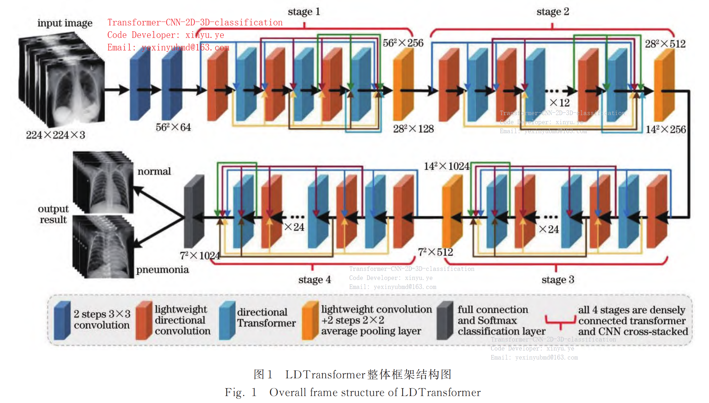  
*图1 LDTransformer 整体框架结构图*  
*Fig. 1 Overall frame structure of LDTransformer*  
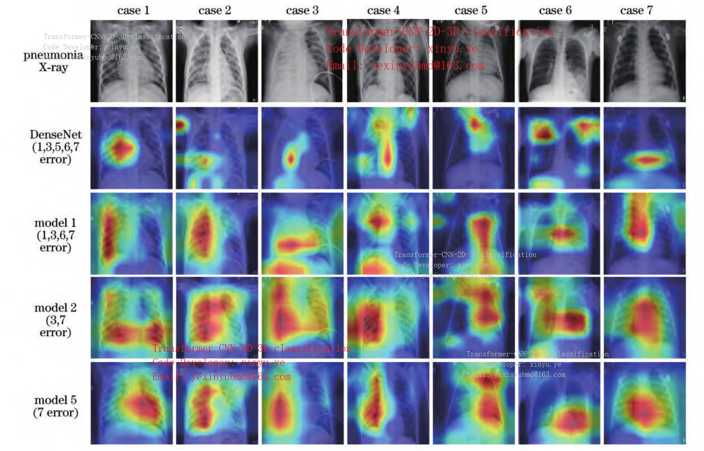  
*图 4　消融模型在肺炎 X 光片上的热力图*  
*Fig. 4 Thermograms of ablation model on pneumonia Xray*  

</div>  

## Table 2 Comparison of evaluation indices with different loss functions
<span style="font-size:20px">表 2　使用不同损失函数时的评价指标对比</span>  

| Model               | Parameter amount | Calculation amount | Total time /s | A /%          | AUC /%        | R /%          | F1 /%         | P /%          |  
|---------------------|------------------|--------------------|---------------|---------------|---------------|---------------|---------------|---------------|  
| EfficientNetb0［3］  | 4.48×10⁴         | 1.35×10⁷           | 15155         | 91.52±2.5     | 91.68±2.8     | 90.78±3.1     | 92.65±2.6     | 94.61±2.4     |  
| MobileNetV3［13］   | 1.66×10⁶         | 6.24×10⁷           | 14757         | 92.05±1.8     | 92.03±2.3     | 92.13±2.2     | 93.17±1.9     | 94.25±1.8     |  
| GhostNet［5］       | 3.90×10⁶         | 1.48×10⁸           | 15398         | 94.17±2.0     | 94.05±2.2     | 94.71±2.4     | 95.03±2.1     | 95.36±2.0     |  
| DeiTS［8］          | 2.19×10⁶         | 4.24×10⁹           | 21986         | 92.78±3.3     | 92.63±3.6     | 93.48±3.1     | 93.85±3.2     | 94.22±3.3     |  
| T2TViT19［9］       | 2.14×10⁶         | 4.33×10⁹           | 22179         | 94.62±2.6     | 94.37±2.9     | 95.84±2.4     | 95.46±2.5     | 95.09±2.5     |  
| XCiTS24-16T［20］   | 4.76×10⁷         | 8.95×10⁹           | 25142         | 96.02±1.9     | 95.94±2.1     | 96.40±1.8     | 96.62±1.8     | 96.84±1.9     |  
| ConvViT［10］       | 4.22×10⁵         | 9.08×10⁷           | 15817         | 93.17±3.9     | 92.99±3.8     | 94.04±4.1     | 94.20±3.8     | 94.36±4.0     |  
| MobileFormer［13］  | 4.58×10⁶         | 9.26×10⁷           | 16124         | 93.37±2.8     | 93.28±2.7     | 93.81±2.8     | 94.43±2.7     | 94.88±2.9     |  
| MobileViT［14］     | 5.63×10⁶         | 1.75×10⁹           | 18978         | 95.19±2.3     | 95.19±2.3     | 96.00±2.4     | 95.27±2.3     | 94.55±2.2     |  
| EdgeNeXtS［21］     | 5.58×10⁶         | 9.57×10⁸           | 16535         | 96.02±2.5     | 95.92±2.4     | 96.51±2.3     | 96.62±2.4     | 96.73±2.6     |  
| NextVitS［22］      | 3.18×10⁷         | 5.79×10⁹           | 20136         | 96.75±2.1     | 96.63±2.0     | 97.30±2.2     | 97.25±2.1     | 97.19±2.0     |  
| **LDTransformer**   | **2.53×10⁵**     | **3.98×10⁷**       | **11783**     | **98.87±0.8** | **98.85±1.0** | **98.99±0.9** | **99.04±0.9** | **99.10±0.8** |  

---

---


# 电子学报 Acta Electronica Sinica
[//]: # (<span style="font-size:26px">电子学报</span>)
## 面向肺部肿瘤分类的跨模态Light-3Dformer模型
## Cross-modal Light-3Dformer Model for Lung tumor classification
[//]: # (<span style="font-size:20px">面向肺部肿瘤分类的跨模态Light-3Dformer模型</span>)
<span style="font-size:14px">Article Link (文章链接)：</span>  
https://kns.cnki.net/kcms2/article/abstract?v=X0pQrW14MIvltC-dZmTVC8htxD9To8c0sXLmWMpKarHkucOfBIuleG9FTdHkp-iwk3BbP6hn5Fob5S5M_QLnPdg1HZHh-m3d9m7W9Gri9jup7ExBDJZlSmNY4NGNLZJFb9qexQ2U-9dUFXkrfXnBI6kkQeEcCOFofI8JhXLv2NM=&uniplatform=NZKPT

## 中文摘要 Abstract
基于深度学习的三维多模态正电子发射型断层扫描/计算机断层扫描（PET/CT）肺部肿瘤识别是一个重要的研究方向。肺部肿瘤病灶的空间形状不规则、与周围组织边界模糊，导致模型难以充分提取肿瘤特征，且模型在三维任务中需要较高的计算复杂度。针对上述问题，本文提出一种跨模态Light-3Dformer的三维肺部肿瘤识别模型。主要创新工作包括：1）采用主、辅网络结构实现多模态特征增强和交互式学习；2）设计Light-3Dformer模块，通过线性元素乘法操作和级联结构实现轻量化；3）提出无参数注意力机制增强三维特征提取；4）设计轻量化跨模态协同注意力模块（LCCAM）。实验结果表明，在自建数据集中模型准确率达90.19%，AUC值89.81%，与3D-SwinTransformer-S相比参数量降低117倍，计算量降低400倍。  
**关键词**：肺部肿瘤；多模态图像；Transformer；Light-3Dformer；轻量化跨模态协同注意力

## English Abstract  
Recognition of 3D multimodal PET/CT lung tumors using deep learning is an important research area. This paper proposes a cross-modal Light-3Dformer model to address challenges including irregular lesion shapes and high computational complexity. Key contributions include: 1) A dual-network architecture for multimodal feature enhancement, 2) Light-3Dformer module with linear element-wise operations, 3) Parameter-free attention mechanism for 3D feature extraction, and 4) Lightweight Cross-modal Collaborative Attention Module (LCCAM). Experiments show 90.19% accuracy and 89.81% AUC on our dataset, with 117× fewer parameters and 400× lower computation than 3D-SwinTransformer-S.  
**Key words**: lung tumor; multimodal images; Transformer; Light-3Dformer; light cross-modal collaborative attention

##  Figures Section  图表部分  
<div align="center">

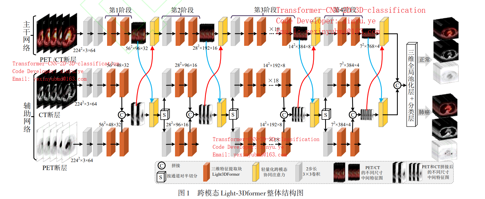  
*图1 跨模态Light-3Dformer整体结构图*  
*Fig. 1 Architecture of cross-modal Light-3Dformer*  
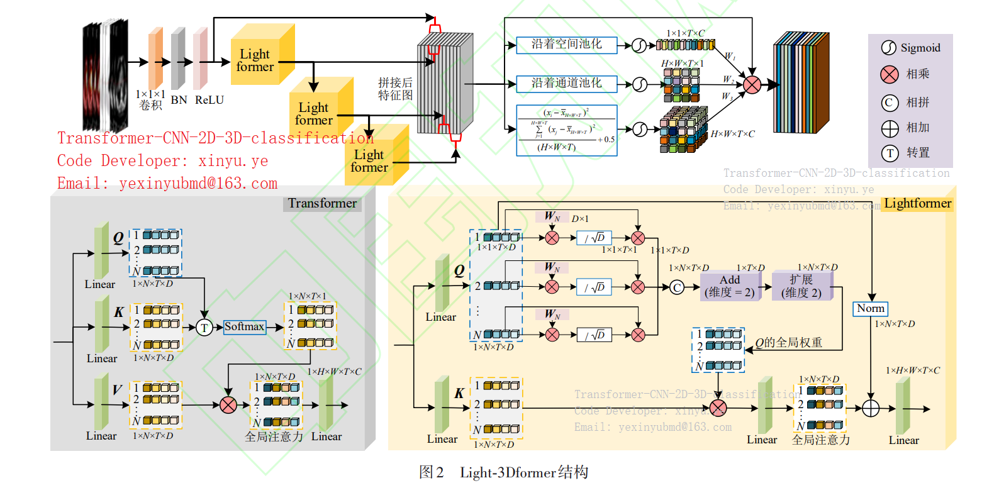  
*图2 Light-3Dformer结构*  
*Fig. 2 Structure of Light-3Dformer*  
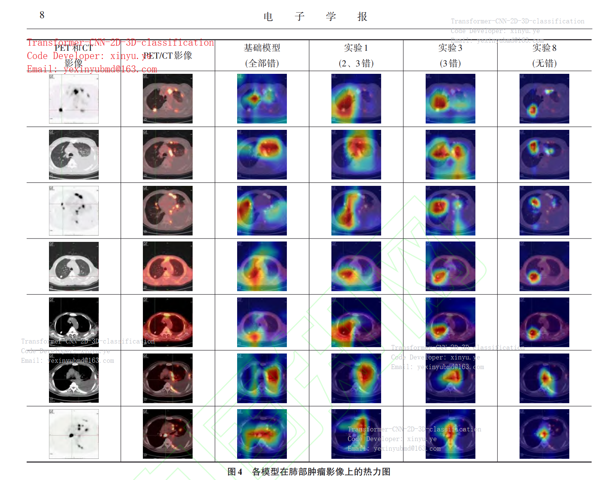   
*图4 热力图*  
*Fig. 4 heatmap*  

</div>

## Table 2. Performance comparison on 3D PET/CT dataset  
<span style="font-size:20px">表2 不同模型在肺部肿瘤PET/CT多模态三维数据集上的实验结果</span>

| 对比模型            | 参数量   | 计算量   | 准确率(%) | AUC值(%) | 训练时间(s) |
|---------------------|----------|----------|------------|----------|-------------|
| 3D-SwinTransformer-S| 48.751M  | 68.210G  | 83.64      | 83.09    | 38,589      |
| Light-3Dformer      | 417.090K | 170.550M | 90.19      | 89.81    | 28,749      |
| 3D-ResNet50         | 46.203M  | 39.981G  | 81.07      | 79.47    | 36,256      |
| 3D-EfficientNet-b3  | 1.624M   | 205.719M | 82.59      | 80.53    | 34,271      |


---

---


# 计算机辅助设计与图形学学报 Journal of Computer-Aided Design & Computer Graphics
[//]: # (<span style="font-size:26px">计算机辅助设计与图形学学报</span>)
## 3D Cross-Modal ConvFormer for Lung Cancer Recognition
<span style="font-size:20px">基于三维跨模态 ConvFormer 的肺部肿瘤识别 </span>  

<span style="font-size:14px">Article Link (文章链接)：</span>  
https://kns.cnki.net/kcms2/article/abstract?v=uXGtp3S0eCAxlLnqB5w_1b0e-ChGSMQ5vIfM_QbSPRHrl0dBCMXSX_C3GHgKReOqJHnEZGm9DDsOVzFDR3OjknvIwTvI_ObzYx-0afvlFA5R3kY7QI77QrUpq1igofXboX-PiYccJVwdo0KwOA--yzMvBiA_HiNKXE28jIDf3ng=&uniplatform=NZKPT

---

## 中文摘要 Abstract
针对三维医学影像因肺部肿瘤形状不规则、差异性大, 导致特征提取不充分和识别不准确的问题, 提出一种基于 CNN 和 Transformer 的三维跨模态肺部肿瘤识别模型 3D-CConvFormer. 首先, 利用三分支网络学习三维 PET, CT 和 PET/CT 影像中病灶的特征; 其次, 设计全局特征与浅层局部特征融合的高效 ConvFormer 模块, 并利用自校正卷积对感受野进行有效扩展, 提高每个模态中对病灶信息的提取能力; 最后, 设计双分支不同分辨率的跨模态特征交互块, 利用 2 个全局注意力机制交叉学习不同模态、全局和局部信息, 交互式地增强跨模态特征提取能力. 实验采用的肺部肿瘤 3D 多模态数据集, 该数据集共有 3 173 例患者, 3D-CConvFormer 模型在参数量和运行时间较优的前提下, 获得了 89.25%的准确率和 88.74%的 AUC 值的最优性能, 为三维多模态肺部肿瘤疾病诊断提供可靠的计算机辅助.  

**关键词**: 肺部肿瘤; ConvFormer; 跨模态特征交互; 三维 PET/CT 多模态影像  

## English Abstract  
Due to the irregular shape and large difference of lung tumors in 3D medical images, the feature extraction of lesions is insufficient, and the recognition accuracy is not high, a 3D Cross-Modal ConvFormer is proposed. Firstly, three networks are utilized to learn the 3D PET, CT and PET/CT medical images. Secondly, a ConvFormer model is designed to fuse global and shallow local features, while self-correcting convolution expands the receptive field for better lesion extraction. Finally, a dual-branch cross-modal feature interaction block is designed to enhance cross-modal features and capture 3D multimodal details. This module uses two global attention mechanisms to improve the extraction of cross-modal and global-local information. The experiments use a 3D multimodal lung tumor dataset with 3 173 patients. With optimized parameters and computation time, the 3D-CConvFormer achieves an accuracy of 89.25% and an AUC of 88.74%, providing reliable computer-aided diagnosis for 3D multimodal lung tumor.  

**Key words**: lung cancer; ConvFormer; cross-modal feature interaction; 3D PET/CT multimodal images  

---

## Figures Section 图表部分  

<div align="center">

  
*图1 3D-CConvFormer 模型结构图*  
*Fig. 1 Architecture of 3D-CConvFormer model*  

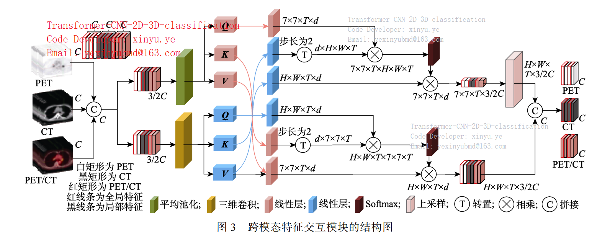  
*图3 跨模态特征交互模块的结构图*  
*Fig. 3 Structure of cross-modal feature interaction module*  

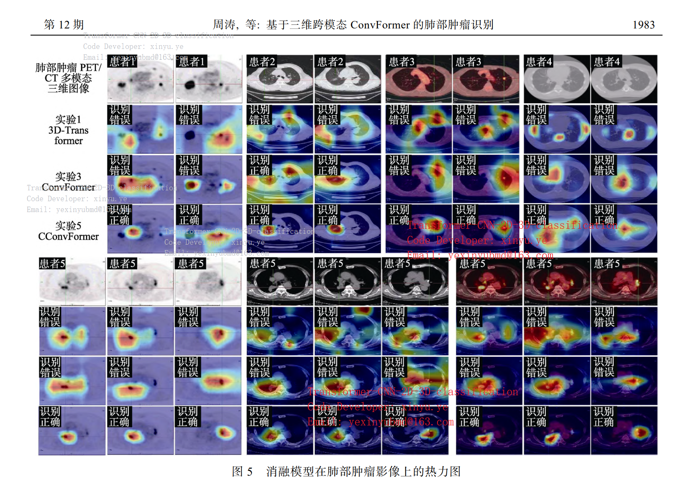  
*图5 消融模型在肺部肿瘤影像上的热力图*  
*Fig. 5 Heatmaps of ablation model on lung tumor images*  

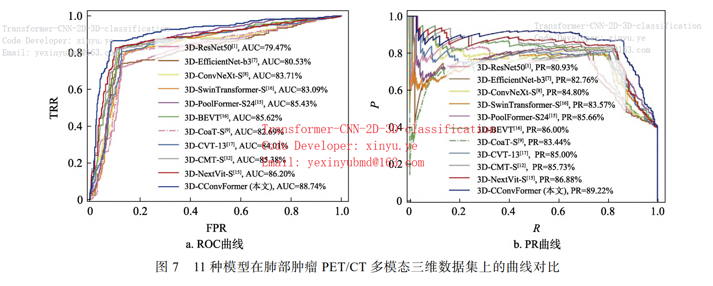  
*图7 11种模型在肺部肿瘤PET/CT多模态三维数据集上的曲线对比*  
*Fig. 7 Performance curves of 11 models on 3D PET/CT multimodal lung tumor dataset*

</div>

---

## Table 3. Performance comparison on 3D PET/CT multimodal lung tumor dataset 
<span style="font-size:20px">表3 对比模型在肺部肿瘤PET/CT多模态三维数据集上的具体结果</span>

| 对比模型             | 参数量   | 准确率/% | AUC/%  | 召回率/% | F1/%   | 精确率/% | 训练时间/s |  
|----------------------|----------|----------|--------|----------|--------|----------|------------|  
| 3D-ResNet50[1]       | 46.203M  | 81.07    | 79.47  | 71.55    | 75.08  | 78.96    | 36 256     |  
| 3D-EfficientNet-b3[7]| 1.624M   | 82.59    | 80.53  | 70.38    | 76.31  | 83.33    | 34 271     |  
| 3D-ConvNeXt-S[8]     | 54.954M  | 84.81    | 83.71  | 78.29    | 80.42  | 82.66    | 37 104     |  
| 3D-SwinTransformer-S | 48.751M | 83.64    | 83.09  | 80.35    | 72.25  | 76.64    | 38 589     |  
| 3D-PoolFormer-S24[15]| 31.687M  | 85.75    | 85.43  | 83.87    | 82.42  | 81.02    | 37 486     |  
| 3D-BEVT[16]         | 86.628M  | 86.09    | 85.62  | 83.28    | 82.68  | 82.08    | 41 718     |  
| 3D-CoaT-S[9]        | 24.385M  | 83.53    | 82.69  | 78.59    | 79.17  | 79.76    | 42 153     |  
| 3D-CVT-13[17]       | 21.430M  | 84.69    | 84.01  | 80.65    | 80.76  | 80.88    | 36 422     |  
| 3D-CMT-S[12]        | 27.278M  | 86.09    | 85.38  | 81.82    | 82.42  | 83.04    | 35 874     |  
| 3D-NextVit-S[15]    | 19.900M  | 86.92    | 86.20  | 82.69    | 83.43  | 84.18    | 34 891     |  
| **3D-CConvFormer**  | **11.199M** | **89.25** | **88.74** | **86.22** | **86.47** | **86.73** | **32 153** |  

---

---


# Journal of Electronics & Information Technology  

<span style="font-size:26px">电子与信息学报</span>

## Dense Heavy Parameter Lightweight Transformer Model for CT Image Recognition of COVID-19
<span style="font-size:26px">面向CT图像新冠肺炎识别的密集重参轻量化Transformer模型</span>  

<span style="font-size:14px">Article Link (文章链接)：</span>  
https://kns.cnki.net/kcms2/article/abstract?v=X0pQrW14MIvv2GL4frWiAufAyuCF9PzCXNBohb82rk9mtk3FbOLkXtHvNFv2SAxHnwtTg0CjnZMeYiK6R0kqZq9dQ7iDFuamoV7bIBLHImhf_3npSg79s7Gz5pW2mY4oFrCqu0dUz7GSJK8XlBlnFD41HM6xYkXsYxunks2nL5Y=&uniplatform=NZKPT

---

## 中文摘要 Abstract
新冠(COVID-19)肺炎严重威胁人类健康，基于深度学习的计算机辅助诊断方法能有效提高新冠肺炎的诊断效率。但是深度学习模型结构复杂、参数量和计算量大，在保持模型性能的前提下提高网络轻量化的程度具有重要研究意义，因此，该文提出一种面向CT图像新冠肺炎识别的密集重参轻量化Transformer模型(DRL-Transformer)。首先，为提高模型的轻量化程度，构造了重参密集块和层次化Transformer，在保持模型精度的同时提高计算速度，降低模型参数量；然后，为充分提取新冠肺炎病灶的全局与局部信息，设计层次化Transformer增强全局注意力对局部特征相关性的关注程度，其中采用分组提取全局特征，在不同组之间进行融合获得多层次信息，并且进行信息融合，进一步提高组内和组间特征的交互能力，此外对所有全局特征进行聚合，实现深浅层特征深度融合。最后，在新冠肺炎CT数据集中进行对比实验，结果表明该模型参数量和计算量分别为1.47 M和81.232 M，相比密集网络(DenseNet)参数量降低29倍、计算量降低23倍，该模型对新冠肺炎计算机辅助诊断具有积极的意义，为深度学习模型轻量化提供了新思路。

**关键词**：新冠肺炎；DenseNet；重参密集块；层次化Transformer；轻量化

---

## English Abstract  
COrona VIrus Disease 2019(COVID-19) is a serious threat to human health, deep learning computer aided diagnosis method can effectively improve the diagnosis efficiency. But deep learning models have usually complex structure which have large number of parameters and computations, therefore, a Dense Reparameter Lightweight Transformer(DRLTransformer) for COVID-19 CT recognition is proposed. Firstly, reparameter dense block and hierarchical Transformer are proposed to improve lightweight degree of model, which can improve computation speed and reduce parameters without losing model performance. Secondly, in order to fully extract global and local information of lesions, using hierarchical Transformer enhance global attention on local feature relevance, which use grouping to extract global features and fused between different groups to obtain multi-level information, and then information fusion is used to further improve interaction of intra group and inter group features. In addition, all global features are aggregated to achieve deep fusion of deep and shallow features. Finally, comparative experiments in COVID-19 CT dataset, the results show that the parameters and computations of DRLTransformer are 1.47 M and 81.232 M. Compared to Dense Convolutional Network(DenseNet), parameters are reduced by 29 times and computations are reduced by 23 times. The model proposed in this paper has positive implications for computer aided diagnosis of COVID-19 and provides a new idea for lightweight deep learning model.

**Key words**: COVID-19; DenseNet; Reparameter dense block; Hierarchical Transformer; Lightweight

---

##  Figures Section  图表部分  
<div align="center">

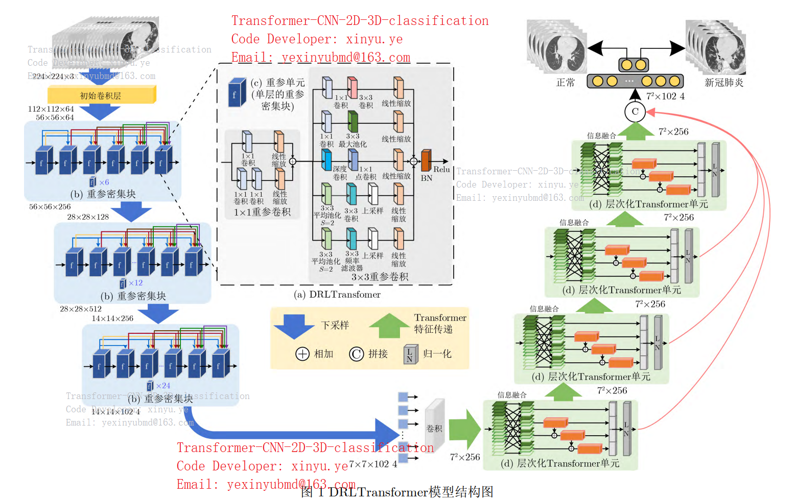  
*图1 DRLTransformer模型结构图*  
*Fig. 1 Architecture of DRLTransformer model*  

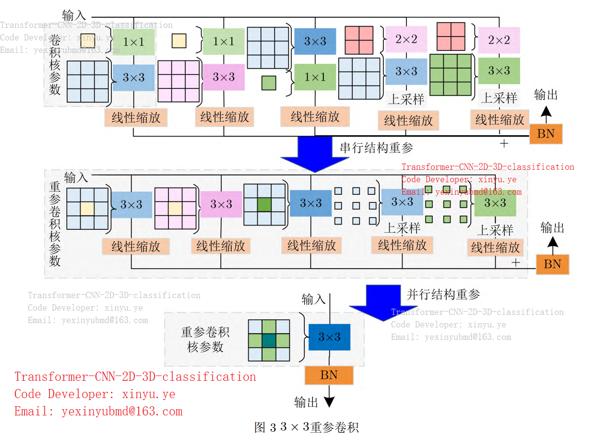  
*图3 3×3重参卷积结构*  
*Fig. 3 Structure of 3×3 reparameter convolution*  
</div>

---

## Table 2. Performance comparison on COVID-19 CT dataset  
<span style="font-size:20px">表2 不同模型在新冠肺炎CT数据集上的具体结果</span>

## Table 2. Performance comparison on COVID-19 CT dataset  
<span style="font-size:20px">表2 不同模型在新冠肺炎CT数据集上的具体结果</span>

| 对比模型         | 模型参数量(M) | 模型计算量 | 训练时间(s) | 准确率 | 精确率 | 召回率 | F1分数 | AUC值 |
|----------------|--------------|------------|-------------|--------|--------|--------|--------|-------|
| ResNet101[3]   | 162.14       | 7.832G     | 12,984      | 0.9441 | 0.9529 | 0.9354 | 0.9441 | 0.9443|
| DenseNet121[15] | 42.62        | 1.816G     | 11,733      | 0.9457 | 0.9447 | 0.9477 | 0.9462 | 0.9457|
| EfficientNetb4[5]| 66.96        | 34.125M    | 11,647      | 0.9581 | 0.9515 | 0.9662 | 0.9588 | 0.9581|
| RegNetx032[16] | 58.35        | 3.176G     | 11,389      | 0.9596 | 0.9628 | 0.9569 | 0.9599 | 0.9597|
| MobileNet[9]   | 12.26        | 2.322G     | 10,533      | 0.9364 | 0.9277 | 0.9477 | 0.9376 | 0.9363|
| GhostNet[2]    | 14.89        | 147.511M   | 7,846       | 0.9519 | 0.9454 | 0.9600 | 0.9527 | 0.9519|
| EdgeNeXt-B[11] | 113.29       | 1.851G     | 12,114      | 0.9628 | 0.9574 | 0.9692 | 0.9633 | 0.9627|
| SwinTransformer| 330.66      | 15.126G    | 17,936      | 0.9628 | 0.9631 | 0.9631 | 0.9631 | 0.9628|
| ReLKNet31B[18] | 300.76       | 15.513G    | 19,346      | 0.9659 | 0.9690 | 0.9631 | 0.9660 | 0.9659|
| ConvNeXt-B[16] | 333.98       | 15.359G    | 16,705      | 0.9689 | 0.9721 | 0.9662 | 0.9691 | 0.9691|
| Conformer-B[17] | 510.06       | 14.486G    | 17,428      | 0.9721 | 0.9694 | 0.9754 | 0.9724 | 0.9721|
| DRLTransformer | 1.47         | 81.232M    | 7,558       | 0.9814 | 0.9786 | 0.9846 | 0.9816 | 0.9814|


---

---


# Pattern Recognition and Artificial Intelligence  

<span style="font-size:26px">模式识别与人工智能</span>

## Pneumonia Classification and Recognition Method Based on Multi-resolution Attention Dense Network  
<span style="font-size:20px">基于多分辨率注意密集网络的肺炎分类识别方法</span>  

<span style="font-size:14px">Article Link (文章链接)：</span>  
https://kns.cnki.net/kcms2/article/abstract?v=X0pQrW14MIuiv4-LuB9ehEovhUdRg3gYk8bVEu1Zy6n9lhpIMbtpojTqtfysj8Do3Rk-1BM436j5rORJLaj1hvnK05G30suN8bQLkvufzDF2GNWpmJgUQ0aKu1J9f7L4bdgEd4Rnq3WorY6rJfSm6ApTX3JDNqUVUfJHczfZqC0=&uniplatform=NZKPT

---

## 中文摘要 Abstract
X光片中肺炎存在影像学特征不明显、病灶与周围组织对比不明显、边缘模糊等问题，因此，文中提出基于多分辨率注意密集网络的肺炎分类识别方法。深度融合浅层定位信息与深层语义信息，并构造多分辨率空间注意力门，对不同分辨率的深层信息与浅层信息进行语义式交互增强，在深浅层信息中建立病灶信息的相互依赖关系。此外，设计坐标频率注意力，以方向和位置互补的方式自适应地增强肺炎特征的表达。在ChestXRay2017等5份肺炎X光片数据集上的实验表明，文中网络在肺炎分类识别任务上性能较优，同时还具有公共肺炎数据集上的鲁棒性。

**关键词**：肺炎识别，多分辨率密集连接，空间注意力门，坐标频率注意力

---

## English Abstract  
X-ray film of pneumonia suffers from inconspicuous imaging features, low contrast between lesions and surrounding tissues, and blurred edges. Therefore, a pneumonia classification and recognition method based on multi-resolution attention dense network is proposed. Shallow localization information and deep semantic information are deeply fused. A multi-resolution spatial attention gate is constructed to enhance semantic interaction between deep and shallow information at different resolutions, establishing interdependency for lesion information in deep and shallow information. In addition, the coordinate frequency attention is designed to adaptively enhance the representation of pneumonia features in a complementary manner of orientation and location. Experiments on five pneumonia X-ray datasets including ChestXRay2017 show that the proposed method achieves better performance in pneumonia classification and recognition task with robustness on the public pneumonia dataset.

**Key Words**: Pneumonia Recognition, Multi-resolution Dense Connection, Spatial Attention Gate, Coordinate Frequency Attention

---

##  Figures Section  图表部分  
<div align="center">

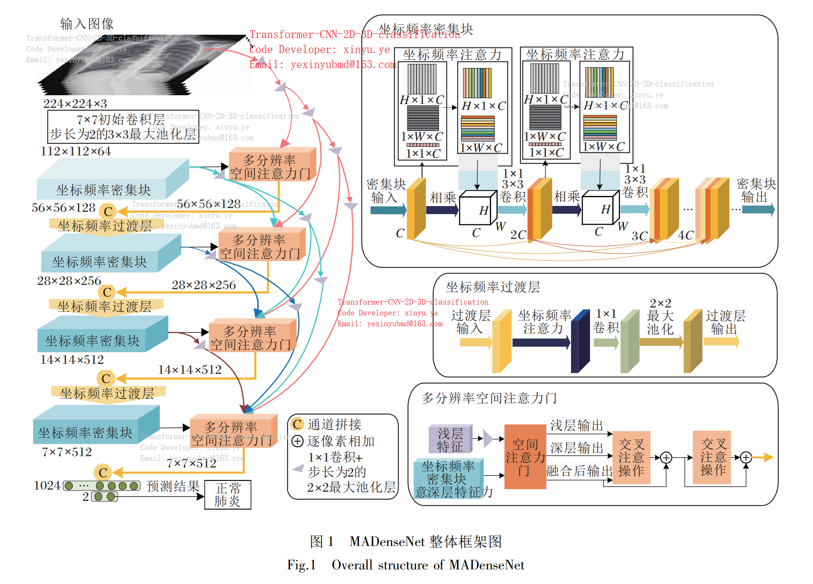  
*图1 MADenseNet整体框架图*  
*Fig. 1 Overall structure of MADenseNet*  

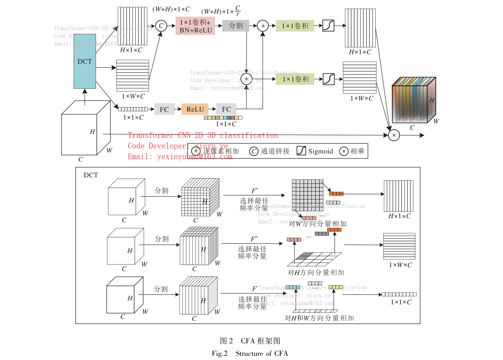  
*图2 CFA框架图*  
*Fig. 2 Structure of CFA*  

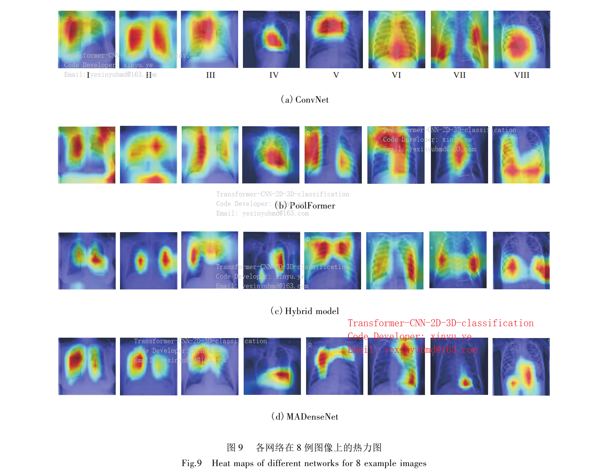  
*图9 各网络在8例图像上的热力图*  
*Fig. 9 Heat maps of different networks for 8 example images*  
</div>

---

## Table 3. Result comparison on ChestXRay2017 dataset  
<span style="font-size:20px">表3 各网络在ChestXRay2017数据集上的对比结果</span>

| 网络               | 类型         | 参数量/M | 训练时间/s | 准确率  | 精确率  | 召回率  | F1     | AUC    |
|------------------|--------------|----------|------------|---------|---------|---------|--------|--------|
| VGG19            | CNN          | 1096.09  | 24,194     | 0.9333  | 0.9491  | 0.9602  | 0.9546 | 0.9104 |
| ResNet101        | CNN          | 324.28   | 18,792     | 0.9418  | 0.9559  | 0.9648  | 0.9603 | 0.9223 |
| DSENet           | CNN          | 93.74    | 18,132     | 0.9607  | 0.9612  | 0.9825  | 0.9734 | 0.9392 |
| REGNETX-3.2GF    | CNN          | 72.66    | 17,953     | 0.9538  | 0.9673  | 0.9696  | 0.9684 | 0.9405 |
| ConvNeXt-B       | CNN          | 464.97   | 19,987     | 0.9658  | 0.9744  | 0.9789  | 0.9766 | 0.9547 |
| Swin Transformer | Transformer  | 460.34   | 20,746     | 0.9573  | 0.9809  | 0.9602  | 0.9704 | 0.9548 |
| PoolFormer-B     | Transformer  | 389.88   | 19,793     | 0.9692  | 0.9835  | 0.9742  | 0.9788 | 0.9649 |
| Conformer-B      | Hybrid       | 710.11   | 22,018     | 0.9709  | 0.9789  | 0.9813  | 0.9801 | 0.9622 |
| Next-Vit-B       | Hybrid       | 238.18   | 18,439     | 0.9726  | 0.9835  | 0.9789  | 0.9812 | 0.9673 |
| MADenseNet       | CNN          | 45.36    | 12,198     | 0.9915  | 0.9967  | 0.9953  | 0.9929 | 0.9882 |


---

---


# Optics and Precision Engineering  

<span style="font-size:26px">光学精密工程</span>

## Pneumonia aided diagnosis model based on dense dual-stream focused network  
<span style="font-size:20px">基于密集双流聚焦网络的肺炎辅助诊断模型</span>  

<span style="font-size:14px">Article Link (文章链接)：</span>  
https://kns.cnki.net/kcms2/article/abstract?v=X0pQrW14MIu71EmD6DnATA8L7SOOW2IQaq2rQM08iAwADGACjnOgLHj03QdNV0cIIq75Y9uHZdXKLDxog-E7uNKkR-jRQOpzaW51u6dakH0bopAnz3jQFIB9ceumHTzbNbgxlCv43tVzk-jfnB4XYbhyrbgl21nruYFjKE1bLQ0=&uniplatform=NZKPT

---

## 中文摘要 Abstract
X光片对肺炎疾病的诊断具有重要作用，但其成像时易受噪声污染，导致肺炎疾病的影像学特征不明显和病灶特征提取不充分。针对上述问题，提出密集双流聚焦网络DDSF-Net的肺炎辅助诊断模型。首先设计残差多尺度块，利用多尺度策略提高网络对医学影像中不同尺寸肺炎病灶的适应性，采用残差连接提高网络参数的传递效率；然后设计双流密集块，采用全局信息流和局部信息流并行结构的密集单元，其中Transformer对全局上下文语义信息进行学习，卷积层进行局部特征提取，利用密集连接方式实现两种信息流的深浅层特征融合；最后，设计具有中心注意操作和邻近插值操作的聚焦块，利用裁剪医学影像尺寸来过滤背景噪声信息，利用插值对医学图像进行放大，增强病灶的细节特征。在肺炎X光片数据集中与典型模型进行对比，本文模型的准确率、精确率、召回率、F1，AUC值和训练时间分别为98.12%，98.83%，99.29%，98.71%，97.71%和15,729 s，准确率和AUC值较密集网络分别提升了4.89%和4.69%。DDSF-Net能够有效缓解肺炎影像学特征不明显和病灶特征提取不充分的问题，通过热力图和三份公共数据集进一步验证了本文模型的有效性和鲁棒性。

**关键词**：医学图像处理；肺炎X光片；密集网络；残差多尺度块；全局和局部信息流；聚焦块

---

## English Abstract  
X-ray images play an important role in the diagnosis of pneumonia disease, but they are susceptible to noise pollution during imaging, resulting in the imaging features of pneumonia being inconspicuous and an insufficient extraction of lesion features. A dense dual-stream focused network DDSF-Net is proposed for the development of an aided diagnosis model for pneumonia to address the above-mentioned problems. First, a residual multi-scale block is designed, a multi-scale strategy is used to improve the adaptability of the network to different sizes of pneumonia lesions in medical images, and a residual connection is used to improve the efficiency of the network parameter transfer. Secondly, a dual-stream dense block is designed, a dense unit with a parallel structure for the global information stream and the local information stream is used, whereby the transformer learns global contextual semantic information. The convolutional layer performs local feature extraction, and a deep and shallow feature fusion of the two information streams is achieved using a dense connection. Finally, focus blocks with central attention operation and neighborhood interpolation operation are designed, background noise information is filtered by cropping the medical image size, and detailed features of lesions are enhanced by interpolating the medical images with magnification. The model obtained 98.12% accuracy, 98.83% precision, 99.29% recall, 98.71% F1, 97.71% AUC and 15,729 s training time, with ACC and AUC improved by 4.89% and 4.69% respectively compared with DenseNet. DDSF-Net effectively alleviates the problems of inconspicuous pneumonia imaging features and insufficient extraction of lesion features. The validity and robustness of this model are further verified by a heat map and three public datasets.

**Key words**: medical image processing; pneumonia X-ray images; dense network; residual multi-scale block; global and local information flow; focus block

---

##  Figures Section  图表部分  
<div align="center">

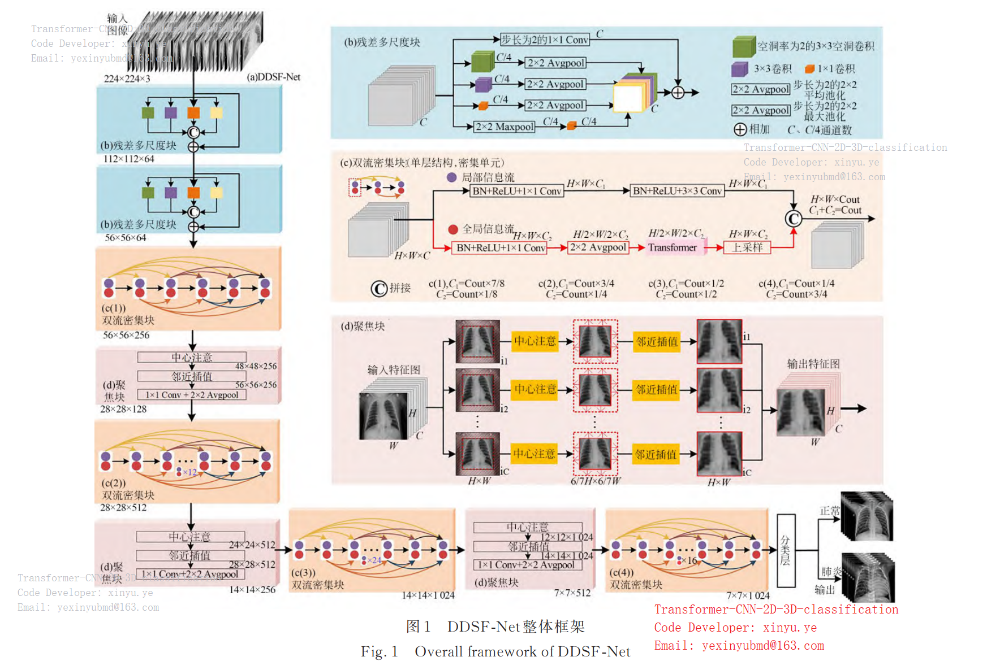  
*图1 DDSF-Net整体框架*  
*Fig. 1 Overall framework of DDSF-Net*  

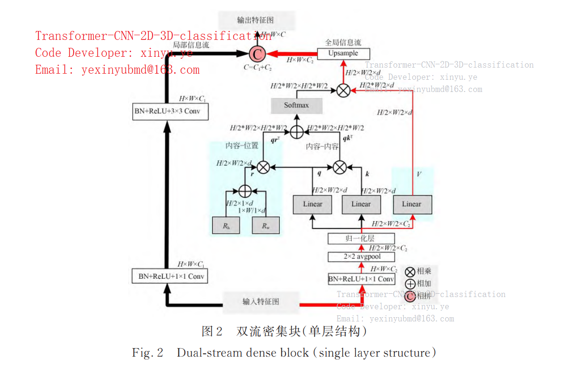  
*图2 双流密集块（单层结构）*  
*Fig. 2 Dual-stream dense block (single layer structure)*  

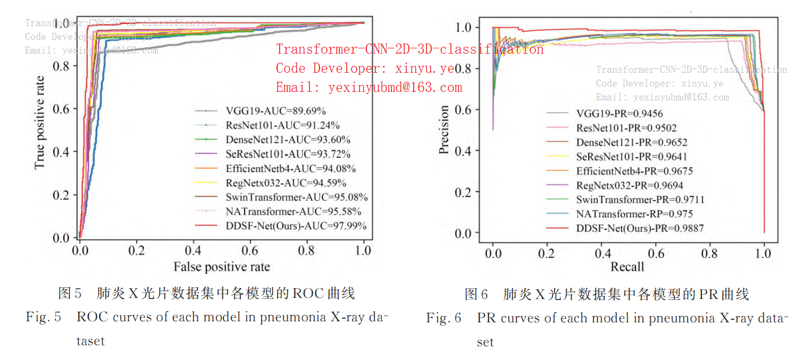  
*图5 肺炎X光片数据集中各模型的ROC曲线*  
*Fig. 5 ROC curves of each model in pneumonia X-ray dataset*  

</div>

---

## Table 2. Performance comparison on pneumonia X-ray dataset  
<span style="font-size:20px">表2 肺炎X光片数据集中各模型的具体结果</span>

| 模型               | 参数量(M) | 计算量(G) | 训练时间(s) | 准确率(%) | 精确率(%) | 召回率(%) | F1分数(%) | AUC值(%) |
|--------------------|-----------|-----------|-------------|------------|------------|------------|-----------|----------|
| VGG19[5]          | 1,096.09  | 39.294    | 26,613      | 89.07±2.4  | 94.81±2.2  | 86.16±2.9  | 90.28±2.2 | 89.69±2.8 |
| ResNet101[8]      | 324.28    | 15.664    | 21,291      | 91.32±1.5  | 93.46±1.5  | 91.68±1.7  | 92.56±1.3 | 91.24±1.9 |
| DenseNet121[4]    | 60.88     | 5.732     | 16,670      | 93.44±2.1  | 96.04±1.8  | 92.69±1.6  | 94.33±1.7 | 93.60±2.0 |
| SeResNet101[8]    | 360.47    | 15.692    | 22,413      | 93.83±1.3  | 95.12±1.2  | 94.38±1.5  | 94.75±1.3 | 93.72±1.4 |
| EfficientNetb0[18]| 30.59     | 0.027     | 15,155      | 91.52±2.5  | 94.61±2.4  | 90.78±3.1  | 92.65±2.6 | 91.68±2.8 |
| EfficientNetb4[11]| 133.91    | 0.068     | 19,299      | 93.97±1.9  | 96.18±1.7  | 93.48±1.5  | 94.81±1.7 | 94.08±1.9 |
| RegNetx032[18]    | 72.66     | 3.955     | 18,492      | 94.63±1.6  | 96.01±1.5  | 94.83±1.6  | 95.42±1.8 | 94.59±1.7 |
| SwinTransformer[14]| 411.75    | 18.836    | 24,327      | 95.29±2.1  | 95.75±2.0  | 96.29±2.2  | 96.02±2.1 | 95.08±2.3 |
| NATransformer[19] | 240.63    | 9.308     | 19,529      | 95.63±1.8  | 96.71±1.6  | 95.84±1.9  | 96.27±1.7 | 95.58±1.9 |
| **DDSF-Net**      | **76.31** | **4.149** | **15,729**  | **98.01±1.1** | **98.53±0.8** | **98.09±0.9** | **98.31±0.8** | **97.99±1.0** |


---

---


# use case
Running the script to view network parameters and save the results to a file
```bash
python 14classification_YXY_查看网络参数量.py >>visual/model_visual.txt
```
This command runs the Python script 14classification_YXY_查看网络参数量.py and appends the output to the file visual/model_visual.txt.  
这个命令会运行 Python 脚本 14classification_YXY_查看网络参数量.py，并将输出追加到文件 visual/model_visual.txt 中。  
Installing PyTorch and related libraries  


---
```bash
conda install pytorch torchvision torchaudio cudatoolkit=11.3 -c pytorch
```
This command uses the Conda package manager to install PyTorch, TorchVision, TorchAudio, and the CUDA toolkit version 11.3 from the official PyTorch channel.  
这个命令使用 Conda 包管理器从官方 PyTorch 渠道安装 PyTorch、TorchVision、TorchAudio 以及 CUDA 工具包 11.3 版本。  
Clearing the CUDA cache

---
```bash
del 后面要加一句torch.cuda.empty_cache()
```
After using the del statement, you should add torch.cuda.empty_cache() to clear the CUDA cache, which helps release GPU memory.  
在使用 del 语句后，应该添加 torch.cuda.empty_cache() 来清空 CUDA 缓存，这有助于释放 GPU 内存。  
Running multiple classification scripts and saving results

---
```bash
python 14classification_YXY_查看网络参数量.py --gpu 0,1 --batchsize 32 --reduction 16 >>visual/model_visual.txt
python 15classification_YXY_56x56.py --gpu 0,1 --batchsize 32 --reduction 16 >>visual/model_visual.txt
```
These commands run the specified Python classification scripts with GPU device numbers 0 and 1, a batch size of 32, and a reduction factor of 16, and append the output to the file visual/model_visual.txt.  
这些命令会运行指定的 Python 分类脚本，使用 GPU 设备编号 0 和 1，批量大小为 32，缩减因子为 16，并将输出追加到文件 visual/model_visual.txt 中。  
Training DenseNet with 4 workers

---
```bash
python 18classification_YXY_CE56.py --gpu 0,1 --batchsize 64 --reduction 16 >>visual/model_visual.txt
```
This command runs the 18classification_YXY_CE56.py script to train the DenseNet model, using GPU devices 0 and 1, a batch size of 64, and a reduction factor of 16, and saves the output to the file visual/model_visual.txt. The num_workers parameter is set to 4.  
这个命令运行 18classification_YXY_CE56.py 脚本来训练 DenseNet 模型，使用 GPU 设备 0 和 1，批量大小为 64，缩减因子为 16，并将输出保存到文件 visual/model_visual.txt 中。num_workers 参数设置为 4。  
Running multiple classification scripts

---
```bash
python 18classification_YXY_CE56.py --gpu 0,1 --batchsize 64 --reduction 16 >>visual/model_visual.txt
python 19classification_YXY_ChestXray2017.py --gpu 0,1 --batchsize 16 --reduction 16 >>visual/model_visual.txt
python 20classification_YXY_CT56.py --gpu 0,1 --batchsize 16 --reduction 16 >>visual/model_visual.txt
python 22classification_YXY_ChestXray14.py --gpu 0,1 --batchsize 16 --reduction 16 >>visual/model_visual.txt
python 24ChestXray2017.py --gpu 0,1 --batchsize 28 --reduction 16 >>visual/model_visual.txt
python 25COVID_CT.py --gpu 0,1 --batchsize 16 --reduction 16 >>visual/model_visual.txt
python 27PET_CT.py --gpu 0,1 --batchsize 28 --reduction 16 >>visual/model_visual.txt
python 28Chest_CT.py --gpu 0 --batchsize 28 --reduction 16 >>visual/model_visual.txt
python 29Chest_CT_D.py --gpu 0 --batchsize 28 --reduction 16 >>visual/model_visual.txt
python 29Chest_CT_D.py --gpu 0 --batchsize 28
python 31rep_COVID.py --gpu 0,1 --batchsize 48 >>visual/model_visual.txt
python 31rep_COVID.py --gpu 0 --batchsize 16 >>visual/model_visual.txt
```
These commands run multiple Python classification scripts with different parameters and append the output to the file visual/model_visual.txt.  
这些命令会运行多个 Python 分类脚本，使用不同的参数，并将输出追加到文件 visual/model_visual.txt 中。  
Running classification scripts and saving results  

---
```bash
python 16classification_YXY_56x56_224x224.py --gpu 0,1 --batchsize 32 --reduction 16 >>model_visual.txt
python 15classification_YXY_56x56.py --gpu 0,1 --batchsize 32 --reduction 16 >>model_visual.txt
```
These commands run the specified Python classification scripts with GPU device numbers 0 and 1, a batch size of 32, and a reduction factor of 16, and append the output to the file model_visual.txt.  
这些命令会运行指定的 Python 分类脚本，使用 GPU 设备编号 0 和 1，批量大小为 32，缩减因子为 16，并将输出追加到文件 model_visual.txt 中。   
Checking GPU memory usage and setting visible GPUs  

---
```bash
nvidia-smi 查看显存后查看PID set CUDA_VISIBLE_DEVICES=0
```
The nvidia-smi command is used to view GPU memory usage and process IDs. The set CUDA_VISIBLE_DEVICES=0 command sets the visible GPU device to device 0.    
nvidia-smi 命令用于查看 GPU 显存使用情况和进程 ID。set CUDA_VISIBLE_DEVICES=0 命令将可见的 GPU 设备设置为设备 0。    
Running Gradient-weighted Class Activation Mapping (Grad-CAM) scripts  

---
```bash

python Grad_CAM/02Grad_CAM_pytorch/main.py --image-path Grad_CAM/02Grad_CAM_pytorch/examples/pic1.jpg --model-index 114 --weight-path /home/yxy/weights/alexnet.pth
python Grad_CAM/02Grad_CAM_pytorch/main.py --model-index 114 --weight-path /home/yxy/weights/alexnet.pth
```
These commands run the Grad-CAM script with the specified image path, model index, and weight path. The second command uses the default image, which is assumed to be an image of a person with COVID-19.  
这些命令运行 Grad-CAM 脚本，指定图像路径、模型索引和权重路径。第二个命令使用默认图像，假设该图像是一张新冠肺炎患者的图像。

---

---


---


